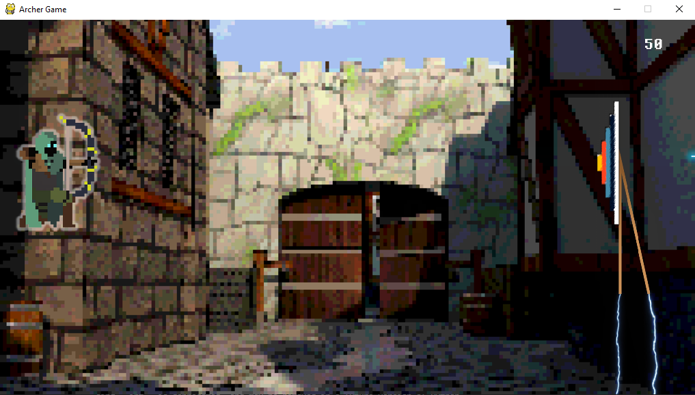

# Archer-PyGame
 An archery game made using python and pygame. To play you can press arrow up/down to move the archer and space/d/arrow right to shoot.

<p align="center">
  
</p>

- The archer can move and shoot.
- The main objective of the game is getting as many points as you can by shooting the closest possible to the center of the target.
---

## Installation

To run this project you need python in a recent version and pip to install pygame(if you don't have it). Create a directory in the project folder and run it(the file path has to be complete, the one in the command is just an example):

```
cd Archer-PyGame
pip install pygame
& python C:/games/Archer-PyGame/main.py
```
Cd is for changing directory to the project folder. The pip install command is for installing the required package. The last command is to run main.py(note that you must use the full file path).

### Clone

- Clone this repo to your local machine using `https://github.com/edumigueis/Archer-PyGame.git`
---

## License


- **[Apache-2.0 LICENSE](https://www.apache.org/licenses/LICENSE-2.0)**
- Copyright 2020 © Eduardo Migueis and Rodrigo Smith.
